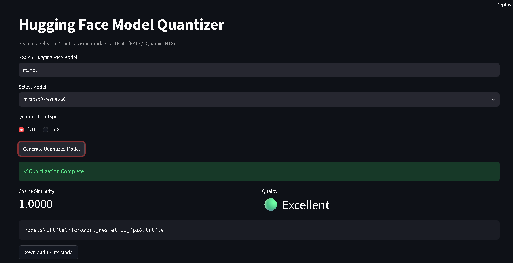

# 🔧 HF Vision Model Quantizer

A tool to **search, download, and quantize** Hugging Face vision models (CNNs) to TFLite format with automatic accuracy verification.

> **Pipeline**: PyTorch → ONNX → TF SavedModel → Quantized TFLite



---

## ✨ Features

- 🔍 **Search** any model on Hugging Face Hub
- 🛡️ **Architecture validation** — rejects unsupported models before wasting time
- ⚙️ **FP16 & Dynamic INT8** quantization
- 📊 **Cosine Similarity** benchmark — compares PyTorch vs TFLite output
- 🔄 **Auto-fallback** — retries with SELECT_TF_OPS if standard conversion fails
- 📥 **One-click download** of the `.tflite` file

---

## 🏗️ Pipeline (8 Steps)

```
[1] Inspect model metadata from Hugging Face
[2] Validate architecture (vision CNNs only)
[3] Download model weights & processor
[4] Export to ONNX (opset 13, dynamic batch)
[5] Verify ONNX graph integrity
[6] Convert ONNX → TF SavedModel (via onnx2tf)
[7] Quantize SavedModel → TFLite (FP16 / INT8)
[8] Benchmark accuracy (Cosine Similarity)
```

---

## 🧠 Supported Architectures

| Architecture | Variants | Status |
|---|---|---|
| MobileNet | v1, v2 | ✅ Verified |
| ResNet | 18, 34, 50, 101, 152 | ✅ Verified |
| EfficientNet | B0–B7 | ✅ Supported |
| ConvNeXt | Tiny, Small, Base, Large | ✅ Supported |
| DenseNet | 121, 161, 169, 201 | ✅ Supported |
| VGG | 11, 16, 19 | ✅ Supported |
| RegNet | Y, X variants | ✅ Supported |
| SqueezeNet | 1.0, 1.1 | ✅ Supported |
| ShuffleNet | v2 | ✅ Supported |
| Others | MnasNet, GoogLeNet, Inception, AlexNet | ✅ Supported |

---

## 📦 Quantization Types

| Type | Size Reduction | Accuracy Loss | Calibration Needed |
|---|---|---|---|
| **FP16** | ~50% (2×) | ~0% | No |
| **Dynamic INT8** | ~75% (4×) | ~1-3% | No |

---

## 🚀 Getting Started

### Prerequisites

```bash
python -m venv venv
venv\Scripts\activate        # Windows
pip install -r requirements.txt
```

### Run the Streamlit UI

```bash
streamlit run app.py
```

### Run via CLI

```bash
python -m scripts.pipeline
```

---

## 📂 Project Structure

```
├── app.py                          # Streamlit UI
├── scripts/
│   ├── pipeline.py                 # 8-step orchestrator
│   ├── utils/
│   │   ├── hf_search.py            # HF Hub search
│   │   ├── model_inspector.py      # Architecture validation
│   │   ├── download_model.py       # Model downloader
│   │   └── benchmark.py            # Cosine similarity verifier
│   └── conversion/
│       ├── export_onnx.py          # PyTorch → ONNX
│       ├── verify_onnx.py          # ONNX validation
│       ├── onnx_to_savedmodel.py   # ONNX → TF SavedModel
│       └── savedmodel_to_tflite.py # SavedModel → TFLite
└── models/                         # Conversion artifacts
```

---

## 🛠️ Tech Stack

| Layer | Technology |
|---|---|
| UI | Streamlit |
| Model Hub | Hugging Face Hub, Transformers |
| PyTorch | torch, torchvision |
| ONNX | onnx, onnxruntime, onnx2tf |
| TensorFlow | tensorflow, ai-edge-litert |

---

## 📄 License

MIT